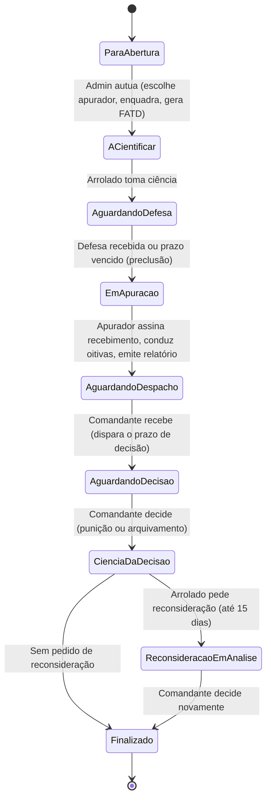
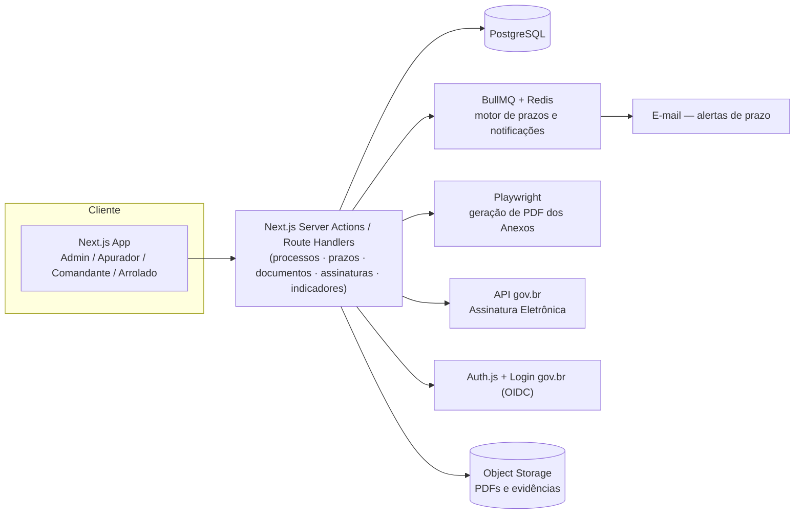

# PRD — Themis: Sistema de Apuração de Transgressão Disciplinar (PATD)

**Status:** MVP definido | **Base legal:** ICA 111-6/2021 (Regulamentação da Sistemática de Apuração
de Transgressão Disciplinar e da Aplicação da Punição Disciplinar), Decreto nº 76.322/1975 (RDAER)

## 1. Sumário executivo

O Themis digitaliza o Processo de Apuração de Transgressão Disciplinar (PATD) do Comando da
Aeronáutica, hoje conduzido inteiramente em papel conforme a ICA 111-6/2021. O produto tem dois
objetivos que se reforçam mutuamente:

1. **Ferramenta operacional** — guiar Admin, Apurador, Comandante e Arrolado por todas as etapas
   do PATD, com prazos controlados automaticamente e os documentos oficiais (Anexos B, D, E/G, F,
   H/Q, I, J, K, M) gerados em PDF e assinados eletronicamente com validade jurídica.
2. **Ferramenta de gestão** — como todo processo nasce estruturado no sistema, o comandante passa
   a ter, sem esforço adicional, indicadores em tempo real (volume, tempo por etapa, prazos
   estourados, tipos de transgressão/punição, reincidência) para subsidiar decisões.

O MVP é um piloto em **uma única Organização Militar (OM)**.

## 2. Problema

O processo em papel tem três dores estruturais:

- **Risco processual**: prazos contados manualmente, formulários preenchidos à mão, nulidades por
  falha de forma (a ICA é rígida quanto a prazos, ordem dos atos e conteúdo dos documentos).
- **Falta de rastreabilidade**: não há trilha auditável centralizada de quem fez o quê e quando.
- **Cegueira gerencial**: o comandante não tem visão agregada de quantos processos estão abertos,
  quanto tempo cada um leva, quais transgressões são mais recorrentes, nem quais militares
  reincidem — cada PATD é uma pasta isolada.

## 3. Personas

| Perfil | Quem é | O que faz no sistema |
|---|---|---|
| **Admin** | Secretaria/SIJ da OM | Lança o ofício de abertura, escolhe o apurador, faz o enquadramento prévio, autua o processo, coleta a ciência de decisões |
| **Apurador** | Oficial designado para apurar | Recebe os autos, conduz oitivas, produz e despacha o relatório |
| **Comandante** | Autoridade competente para decidir | Recebe o relatório, decide (punição/arquivamento), julga reconsideração |
| **Arrolado** | Militar sob apuração | Toma ciência, apresenta defesa, toma ciência da decisão, assina a NPD, pode pedir reconsideração |

*Permissões detalhadas por tela ficam para uma rodada de refinamento dedicada — este PRD assume o
escopo de ações acima, definido na sessão de MVP.*

Testemunhas e SIJ **não têm perfil de acesso**: os atos que hoje dependem de testemunhas físicas
(certidão de recusa, certidão de preclusão, termos de inquirição) passam a ser registrados como
eventos da trilha de auditoria eletrônica, sob a autoria de Admin/Apurador autenticados.

## 4. Escopo do MVP

### 4.1 Fluxo do processo (máquina de estados)

| # | Status | Responsável | Documento(s) PDF gerado(s) |
|---|---|---|---|
| 1 | Para abertura | Admin | — (anexa o ofício original) |
| 2 | A cientificar | Admin | Despacho de Abertura (Anexo B) + FATD (Anexo D) |
| 3 | Aguardando defesa | Arrolado | FATD c/ ciência; Alegações de Defesa (Anexo F) ou Certidão de Preclusão (Anexo G) |
| 4 | Em apuração | Apurador | Termo(s) de Inquirição (Anexo H/Q), se houver |
| 5 | Aguardando despacho | Apurador | Relatório do Apurador (Anexo I) |
| 6 | Aguardando decisão | Comandante | Decisão da Autoridade (Anexo J) |
| 7 | Ciência da decisão | Admin → Arrolado | Nota de Punição Disciplinar (Anexo K), se punição |
| 7a | Reconsideração em análise *(opcional)* | Arrolado → Comandante | Pedido de Reconsideração (Anexo M) + nova Decisão (Anexo J) |
| 8 | Finalizado | — | PDF consolidado do dossiê completo |

### 4.2 Épicos incluídos no MVP

- **E1 — Condução guiada do processo**: workflow acima, do lançamento do ofício ao fechamento.
- **E2 — Motor de prazos**: contagem em dias úteis, início do prazo vinculado ao "recebimento"
  formal do responsável da vez, alertas de vencimento/próximo do vencimento.
- **E3 — Geração de documentos em PDF**: cada Anexo gerado automaticamente a partir dos dados
  preenchidos, baixável individualmente e como dossiê consolidado.
- **E4 — Assinatura eletrônica com validade jurídica**: ciência, recebimento, defesa, decisão, NPD
  e reconsideração assinados eletronicamente, com timestamp e hash — essa trilha substitui a
  exigência de testemunhas físicas.
- **E5 — Painel do Comandante**: indicadores derivados diretamente dos dados operacionais (ver
  seção 7).
- **E6 — Controle de acesso e trilha de auditoria**: RBAC pelos 4 perfis + histórico imutável de
  cada processo.

### 4.3 Fora do escopo do MVP (v2+)

- Módulo próprio de Sindicância/IPM (no MVP, apenas se anexa o documento de origem).
- Integração com SARAM/SIGPES — cadastro de militares é manual no piloto.
- Grade de Punição digital com controle diário de apresentação pelo Oficial-de-dia (cumprimento
  vira só um status "em cumprimento/cumprida").
- Casos especiais (gestante/lactante, cumprimento em residência, transferência de OM em curso).
- Comparação entre múltiplas OMs no painel de indicadores.
- App mobile nativo / modo offline.
- Gravação/transcrição de videoconferência dentro do app.

## 5. Requisitos funcionais

| ID | Descrição |
|---|---|
| RF-01 | Admin registra a abertura a partir de um ofício/relato (dados + anexo do documento original) |
| RF-02 | Admin seleciona o apurador e registra o enquadramento prévio no art. 10 do RDAER |
| RF-03 | Sistema gera automaticamente Despacho de Abertura (Anexo B) e FATD (Anexo D) em PDF |
| RF-04 | Arrolado visualiza o FATD e registra ciência eletronicamente |
| RF-05 | Se o arrolado não interagir dentro do prazo, Admin registra ciência/recusa manualmente, com justificativa, gerando o evento de auditoria correspondente |
| RF-06 | Arrolado envia alegações de defesa (texto estruturado ou upload), gerando o Anexo F |
| RF-07 | Sistema gera Certidão de Preclusão (Anexo G) automaticamente se o prazo de defesa vencer sem manifestação |
| RF-08 | Apurador assina o recebimento dos autos, iniciando o prazo de elaboração do relatório |
| RF-09 | Apurador registra termos de inquirição (arrolado e/ou testemunhas), gerando Anexos H/Q |
| RF-10 | Apurador emite o relatório (Anexo I) com campos estruturados: procedência, classificação, atenuantes/agravantes, proposta de punição ou arquivamento |
| RF-11 | Comandante recebe o processo (ação que dispara o prazo de decisão) |
| RF-12 | Comandante registra a decisão (Anexo J): concorda ou diverge do relatório, pune ou arquiva |
| RF-13 | Sistema gera Nota de Punição Disciplinar (Anexo K) quando há punição |
| RF-14 | Admin coleta a ciência do arrolado sobre a decisão/NPD |
| RF-15 | Arrolado pode solicitar reconsideração dentro de 15 dias corridos da ciência (Anexo M) |
| RF-16 | Sistema alerta (não bloqueia) o Comandante de que a punição não pode ser agravada em reconsideração sem fato novo, ao julgar o pedido |
| RF-17 | Sistema fecha o processo automaticamente em "Finalizado" se o prazo de reconsideração expirar sem pedido |
| RF-18 | Qualquer documento gerado pode ser baixado individualmente em PDF |
| RF-19 | O processo completo pode ser baixado como um único PDF consolidado (dossiê), na ordem cronológica de autuação |
| RF-20 | Todas as assinaturas eletrônicas registram identidade do signatário, timestamp e hash do documento assinado |
| RF-21 | Sistema calcula prazos em dias úteis, com prorrogação automática quando o vencimento cai em dia sem expediente |
| RF-22 | Sistema notifica o responsável da vez quando um prazo está próximo do vencimento ou vencido |
| RF-23 | Comandante visualiza painel com os indicadores da seção 7, filtráveis por período |
| RF-24 | Cada perfil só acessa os processos e dados aos quais tem permissão (RBAC) |

## 6. Requisitos não funcionais

- **RNF-01 (Sigilo)**: toda a documentação é classificada como "Informação Pessoal – Acesso
  Restrito" (LAI, art. 31). Controle de acesso por perfil é obrigatório desde o primeiro registro,
  sem exceção — inclusive nos indicadores agregados (nunca expor dados que permitam identificar
  um militar fora de quem tem permissão de ver aquele processo específico).
- **RNF-02 (Auditabilidade)**: histórico de cada processo é imutável (append-only) e deve permitir
  reconstruir integralmente a linha do tempo de qualquer PATD.
- **RNF-03 (Validade jurídica)**: assinaturas eletrônicas devem atender ao menos o nível
  "avançado" da Lei nº 14.063/2020 para atos da administração pública federal.
- **RNF-04 (Conformidade com a ICA 111-6)**: prazos, ordem dos atos e conteúdo mínimo de cada
  documento devem espelhar fielmente o que a Instrução exige.
- **RNF-05 (Usabilidade)**: interface deve ser utilizável por militares sem familiaridade com
  ferramentas de TI — linguagem simples, fluxo linear, sem jargão de sistema.
- **RNF-06 (Disponibilidade)**: prazos legais correm independentemente do sistema estar no ar;
  indisponibilidade prolongada é um risco operacional a ser monitorado (SLA a definir com a OM).
- **RNF-07 (LGPD)**: dados pessoais do arrolado/testemunhas tratados com base legal de exercício
  regular de dever legal (apuração disciplinar), com retenção e acesso mínimos necessários.

## 7. Indicadores do painel do Comandante

- Total de PATDs por status/etapa atual.
- Tempo médio de tramitação (total e por etapa).
- Prazos vencidos / em risco, em tempo real.
- Distribuição por item do art. 10 do RDAER (tipo de transgressão).
- Distribuição por tipo de decisão (punição vs. arquivamento) e por tipo de punição aplicada.
- Taxa e desfecho de pedidos de reconsideração.
- Militares com mais de um PATD (reincidência).

## 8. Stack técnica proposta

| Camada | Escolha | Por quê |
|---|---|---|
| Frontend | **Next.js (App Router) + TypeScript + Tailwind CSS** | Um único time/linguagem ponta a ponta; Tailwind consome direto os tokens já definidos em `design-tokens/`; App Router facilita páginas server-rendered para dados sensíveis |
| Componentes | **shadcn/ui** | Componentes acessíveis e customizáveis com os tokens de cor da FAB, sem lock-in de biblioteca de UI |
| Formulários | **React Hook Form + Zod** | Validação de schema compartilhada entre formulário e backend (mesmos tipos) |
| Backend | **Mesmo monólito Next.js** (Route Handlers/Server Actions), com camada de domínio isolada em módulos internos (`processos`, `prazos`, `documentos`, `assinaturas`, `indicadores`) | Reduz de dois serviços para um no MVP; a separação por módulo permite extrair um serviço dedicado depois, se necessário (ex.: quando entrar app mobile) |
| Banco de dados | **PostgreSQL** | Suporta Row-Level Security (reforça RNF-01 direto no banco), boas capacidades analíticas (window functions) para os indicadores |
| ORM | **Prisma** | Migrations versionadas, tipagem ponta a ponta com TypeScript |
| Autenticação | **Auth.js** com provedor OIDC customizado para o **Login gov.br** | Reaproveita a mesma identidade usada na assinatura eletrônica; RBAC dos 4 perfis mantido na aplicação |
| Assinatura eletrônica | Integração com a **API da Plataforma gov.br de Assinatura Eletrônica** (nível avançado) | Evita construir PKI própria; padrão já usado por outros sistemas da administração federal (ex. SEI) |
| Geração de PDF | Templates HTML/CSS (com os tokens de cor institucionais) renderizados via componentes server-side, convertidos com **Playwright headless** | Fidelidade total ao layout dos Anexos da ICA (cabeçalho, marcas d'água de sigilo, numeração) |
| Prazos e jobs assíncronos | **BullMQ + Redis** | Cálculo diário de dias úteis/feriados, disparo de alertas e notificações |
| Armazenamento de arquivos | Object storage compatível com S3 (ex.: R2/S3), criptografado em repouso | PDFs gerados, ofícios digitalizados, evidências de oitiva |
| Notificações | E-mail transacional | Lembretes de prazo — avaliar domínio institucional vs. serviço externo conforme política de TI da OM |
| Testes | **Vitest** (unitário) + **Playwright** (E2E) | E2E cobrindo o fluxo ponta a ponta dos 10 estados |
| CI/CD | **GitHub Actions** | Repositório já hospedado no GitHub |
| Hospedagem | **Em aberto** — decisão institucional entre infraestrutura própria do COMAER/DTI vs. nuvem com residência de dados no Brasil | Aplicação deve ser containerizada (Docker) desde o início para portabilidade entre os dois cenários |

### Arquitetura em alto nível

## 9. Modelo de dados conceitual

- **Usuario**: perfil (Admin/Apurador/Comandante/Arrolado), identidade gov.br, OM.
- **OrganizacaoMilitar**: dados da OM do piloto.
- **Processo (PATD)**: número, status atual, OM, militar arrolado, datas.
- **Enquadramento**: item(ns) do art. 10 do RDAER associados ao processo, classificação
  (leve/grave), atenuantes/agravantes (art. 13).
- **Documento**: tipo (mapeado ao Anexo correspondente), versão, PDF gerado, hash.
- **Assinatura**: documento assinado, signatário, timestamp, protocolo da API gov.br.
- **EventoAuditoria**: log append-only de toda ação relevante do processo (quem, o quê, quando).
- **Prazo**: tipo (defesa, relatório, decisão, reconsideração), data de início, data limite,
  status (em curso, cumprido, vencido, prorrogado).
- **Decisao**: tipo (punição/arquivamento), tipo de punição, se houve reconsideração e desfecho.

## 10. Premissas e riscos

| Item | Tipo | Observação |
|---|---|---|
| Hospedagem (infra própria vs. nuvem) | Risco/decisão institucional | Não é decisão técnica do time de produto — precisa validação com TI/DTI da OM |
| Viabilidade de integração com Login/Assinatura gov.br para militares | Premissa a validar | Depende de os militares possuírem conta gov.br em nível compatível (avançado) |
| Cadastro de militares manual no piloto | Premissa aceita para o MVP | Sem integração SARAM/SIGPES nesta fase |
| Adoção pelos usuários (Admin/Apurador/Comandante) | Risco de produto | Interface precisa ser mais simples que preencher o formulário em papel, ou a adoção falha |

## 11. Critérios de aceite do MVP

1. Um PATD nasce do lançamento do ofício e percorre todas as etapas — incluindo o caminho de
   reconsideração — inteiramente dentro do sistema.
2. Todos os documentos (Anexos B, D, E/G, F, H/Q, I, J, K, M) são gerados em PDF com assinatura
   eletrônica válida, baixáveis individualmente e como dossiê único.
3. Prazos calculados automaticamente em dias úteis, com alerta para o responsável da vez.
4. Painel do Comandante funcionando com os indicadores da seção 7, restrito à sua OM.
5. Controle de acesso por perfil e trilha de auditoria completa e imutável.
